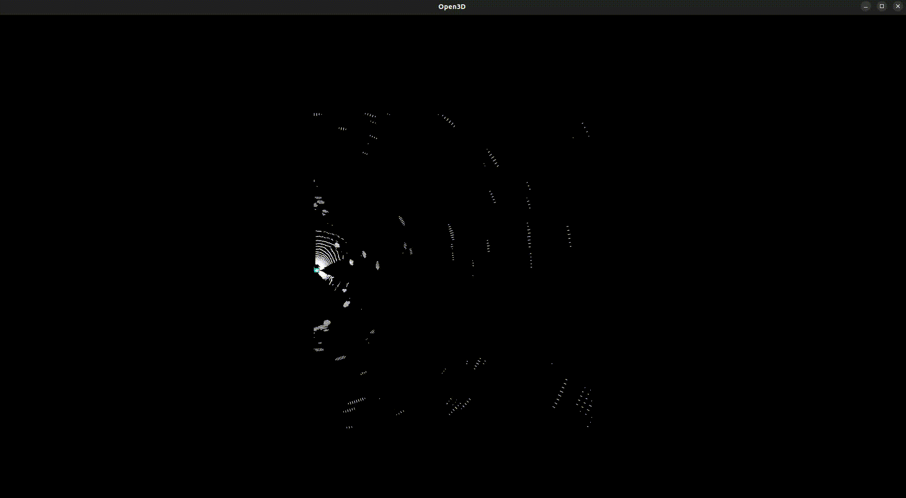

# 🚶 Sensor Sync: Pedestrian Detection Pipeline (ROS 2 Humble)

This repository contains ROS 2 packages that transform raw LiDAR, radar, and camera data into synchronized, calibrated, and pseudo-labeled datasets—ready to be used for pedestrian behavior prediction and training trajectory models.

---

## 📋 Overview

This pipeline works in three main stages:

1. **Data Synchronization and Calibration** (`sensor_sync`)
2. **Pseudo-labeling Pedestrians with PointRCNN_IoU** (`data_labeler`)
3. **Optional Visualization** (`visualizer.py`)

All stages are ROS 2 Humble–compatible and can be tested with real sensors or using recorded `rosbag` files.

---

## 🧰 Supported Sensors

These packages assume the following setup (can be modified):

- **Navtech RAS3**         → `/radar_data/point_cloud`  
- **Ouster OS1 LiDAR**     → `/ouster/points`  
- **Intel RealSense Camera** → `/camera/camera/color/image_raw`

You can use either real-time sensor data or recorded `rosbag` files.

---

## 📦 Packages

### ✅ `sensor_sync`

Responsible for synchronizing, calibrating, and saving data from all sensors:

- Synchronizes based on the fastest sensor
- Applies `tf_static` transformations to align all data to the `base_link` frame
- Saves data as `.pcd` and image files

**Output**: Synchronized `.pcd` and image dataset.

---

### ✅ `data_labeler`

Uses a modified **PointRCNN_IoU** model to pseudo-label the point cloud data (pedestrians only).

- Input: Output folder from `sensor_sync`
- Output: JSON file containing 3D bounding boxes for each pedestrian

Example output:
```json
[
  {
    "frame_id": 0,
    "id": 0,
    "x": 2.46,
    "y": 5.10,
    "z": -0.27,
    "dx": 0.82,
    "dy": 0.67,
    "dz": 1.69,
    "yaw": 1.59,
    "score": 0.57,
    "label": 2
  },
  ...
]
```

## 🔧 Installation

### 🧾 Prerequisites

- **Ubuntu 22.04**
- **ROS 2 Humble**
- Python 3 with `pip`


### 📥 Clone and Build

In your ROS 2 workspace:

```bash
cd ~/ros_ws
git clone git@github.com:DanMS98/multimodal_pipeline.git
mv multimodal_pipeline/* ~/ros_ws 
pip3 install -r requirements.txt
colcon build
source install/setup.bash
```


### 🚀 Running `sensor_sync`

After building, you can run the synchronizer node (see launch files in the package or write your own custom node using `sensor_sync`'s interface).
run the launch file using:
```bash
ros2 launch sensor_sync start_sync_line.launch.py 
```
if you want to see the results of each node in different terminals:
```bash
ros2 launch sensor_sync start_sync_line.launch.py use_terminals:=true
```


### 🧠 Running `data_labeler`

1. Install [OpenPCDet](https://github.com/open-mmlab/OpenPCDet/blob/master/docs/INSTALL.md)
2. Edit `detector.py` that is located in `data_labeler`:
   - Set `cfg_file`, `ckpt_path`, and `OpenPCDet root` path
   - Set `dataset_path` to your synchronized PCD dataset

Then:

```bash
ros2 run data_labeler detector
```

This launches a ROS 2 which is a**SERVICE NODE**.

In a new terminal, call the service:

```bash
ros2 service call /run_detection interfaces/srv/RunDetection
```

✅ **Output**: JSON file labeling pedestrians per frame.


## 🏋️ Training Your Model
The provided JSON can be use to train different models.
in this project it was used to train trajactory prediction model of STGCNN.

### 📈 Example: STGCNN

you can use `convert_to_stgcnn.py` file to convert the detected JSON to the input format of the model used in this project: https://github.com/abduallahmohamed/Social-STGCNN <br>
You may also modify the script to adapt to other models.


## 🎬 Demo

### 🧩 Data Synchronizer

Radar + LiDAR data combined and calibrated:


### 🧠 Pseudo-labeler Output

Detected pedestrian bounding boxes using PointRCNN_IoU:




### 🖼️ Visualizer: LiDAR/Radar → Camera Projection

Visualizes 3D points from radar/LiDAR on the 2D camera image using `tf_static` and camera intrinsics.

```bash
ros2 run sensor_sync visualizer.py
```

- Set `use_synced_topics=True` to check data alignment
- Good for checking `rosbag` integrity and sensor synchronization


## Notes

- All transforms are assumed to be known (`tf_static`)
- The pseudo-labeler is not perfect—labels are used as weak supervision

## Credits & Disclaimer
This project’s detector logic is adapted from OpenPCDet, an open-source toolbox for 3D object detection from point clouds.
I gratefully acknowledge their contribution—especially the data loading, model inference, and visualizer components that were modified to suit our pedestrian-only labeling needs.
OpenPCDet is licensed under the BSD 3-Clause License, and this repository complies with its terms.
